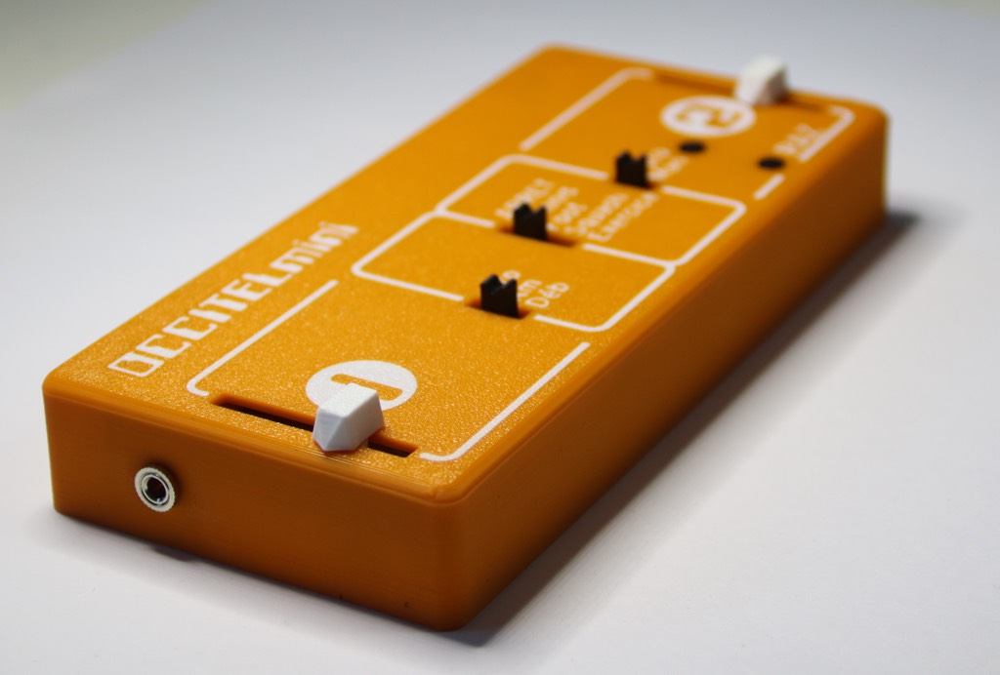
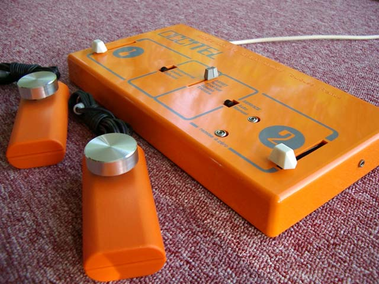
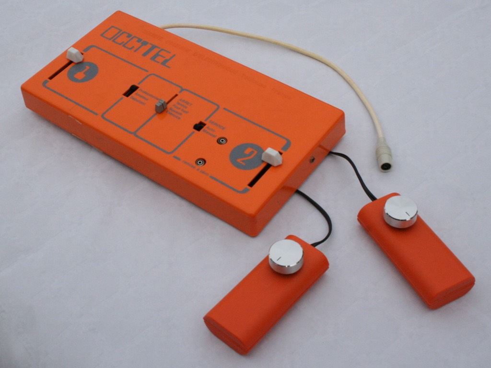
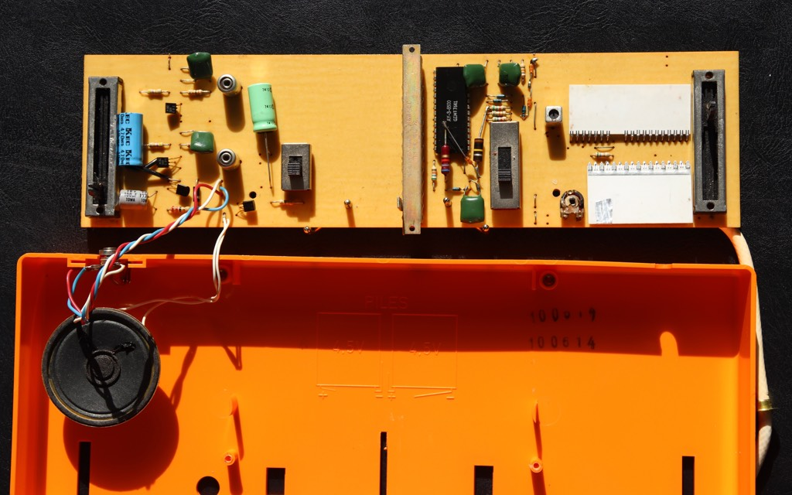
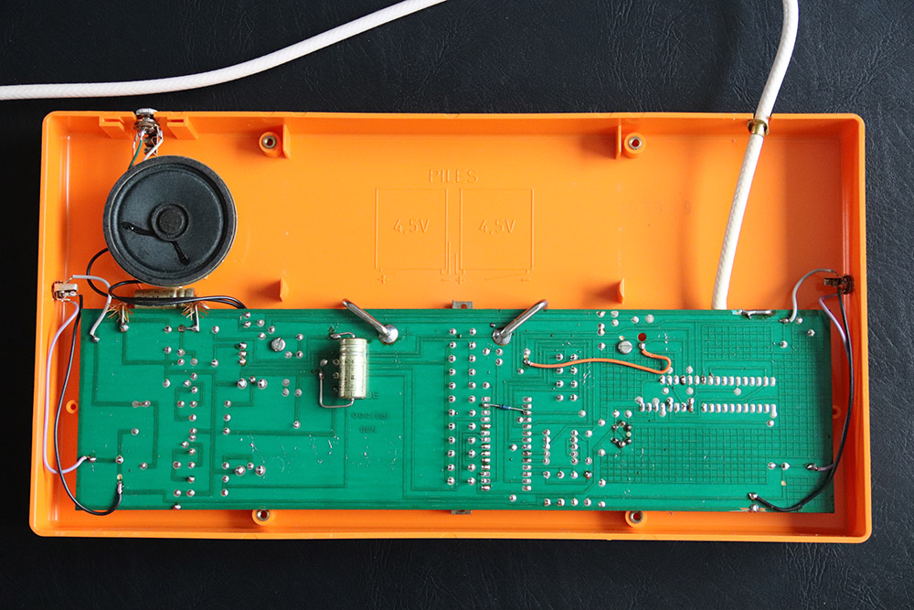
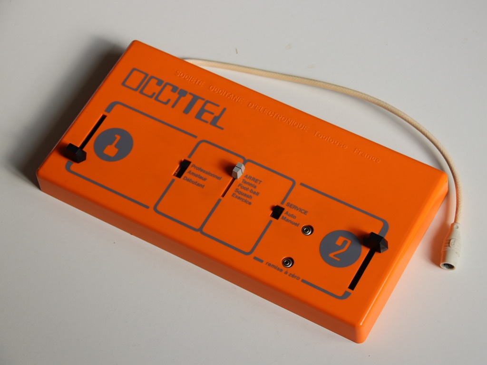
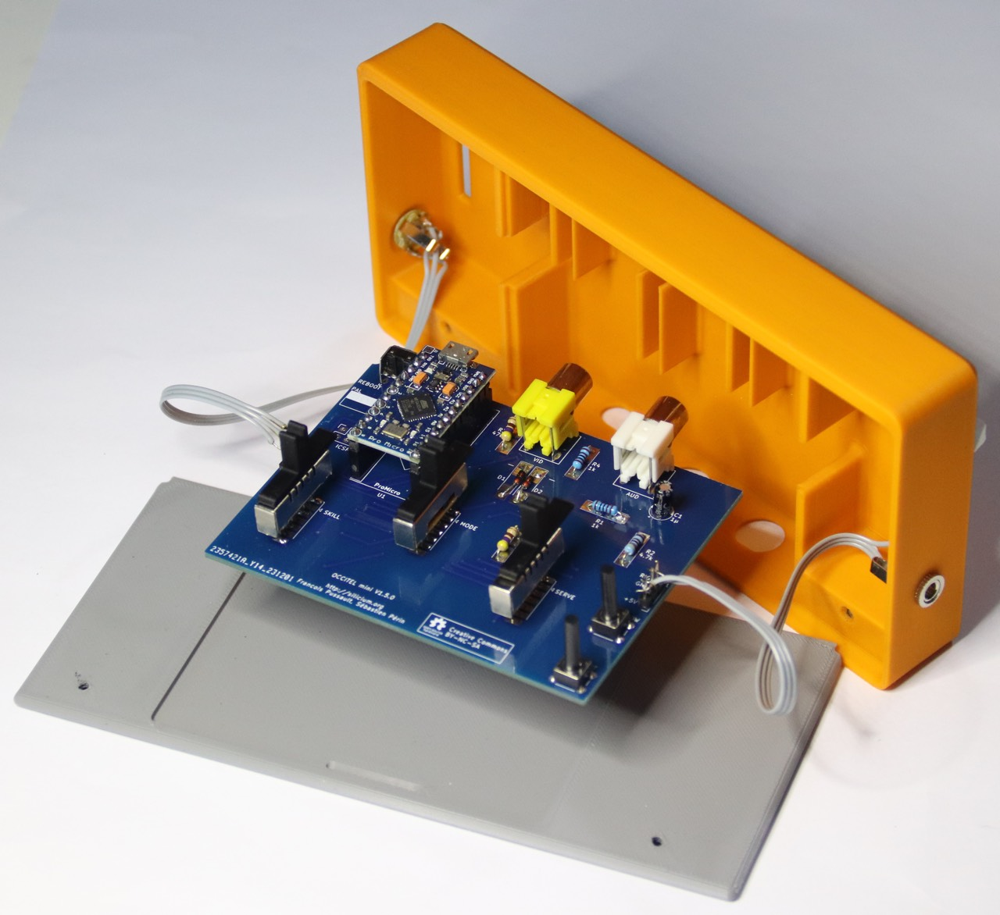

# [Occitel Mini](https://silicium.org/index.php/edition/occitel-mini-2), une production (c)2020..2025 [association Silicium](http://silicium.org)

## J'ai pas l'temps

L'[Occitel Mini](https://silicium.org/index.php/edition/occitel-mini-2) est une reproduction à l'échelle 1/2 de la console [Occitel](https://silicium.org/index.php/blog-catalogue/pongs/societe-occitane-d-electronique-occitel) sortie en 1976 par la [Société occitane d'électronique](https://fr.wikipedia.org/wiki/Société_occitane_d%27électronique), sur la base du circuit [AY-3-8500](https://fr.wikipedia.org/wiki/AY-3-8500) sorti la même année par [General Instruments](https://fr.wikipedia.org/wiki/General_Instrument), comme quasiment toutes les autres consoles Pong de l'époque.

Nous avons fabriqué un premier lot, et qui peut dire si nous nous y remettrons une fois partis tous les exemplaires ?
Commandez la vôtre [auprès de Silicium](https://silicium.org/index.php/contactez-nous) ou rendez-nous visites [dans la vraie vie](https://www.facebook.com/siliciumasso/photos/le-tgs-au-meett-de-toulouse-cétait-du-30-novembre-au-1er-décembre-si-vous-lavez-/1154207946707585/) par exemple au [Toulouse Game Show](https://tgs-toulouse.fr). \
La console est fournie avec un livret de 70 pages en couleur, plein d'éléments historiques, d'entretiens, de photos anciennes et nouvelles, dans un emballage en carton à l'instar de l'original, photo de couverture comprise—les connaisseurs apprécieront…

### Mise en route
- connectez l'Occitel Mini à l'entrée composite de votre télévision avec un câble 75Ω
- connectez les manettes fournies
- alimentez l'Occitel Mini à l'aide d'un câble USB Micro-B
  - attention: l'Occitel Mini consomme _si peu_ qu'une batterie USB risque de se mettre en sommeil, croyant n'être connectée à rien
  - vous pouvez alimenter et même reprogrammer votre Occitel Mini depuis un ordinateur grâce à [l'éditeur Arduino](https://www.arduino.cc/en/software)
- allumez l'Occitel Mini à l'aide du `sélecteur de jeu`
  - vous verrez 2 DEL luire à travers le boîtier, clignotant au rythme des échanges entre les 2 raquettes—si le clignottement cesse, le logiciel s'est planté ⇒ faites-nous un rapport d'anomalie
  - consultez le manuel de votre Occitel originale pour en savoir plus sur les autres fonctions
- à l'allumage, l'Occitel Mini émulate la version 1976 de l'AY-3-8500—un appui long sur le bouton `Remise à zéro` basculera sur la version 1977, dont les graphismes sont légèrement différents
- la carte-mère dispose d'un emplacement pour cavalier (non installé) permettant de choisir entre PAL (50Hz) et NTSC (60Hz) : vous pouvez souder les pastilles en court-circuit, ou installer un cavalier ou un interrupteur

### Juridique
La famille du fondateur de la Société occitane d'électronique a donné permission à l'association Silicium sise à Toulouse, d'adapter et reproduire ses créations.

Le livre Occitel est propriété de l'association Silicium à Toulouse, France, distribué sous licence Creative Commons CC-BY-NC-SA.

Grant Searle n'a pas précisé de licence lorsqu'il a publié son AVRPong alias TVGame 1.5. Le site web dit "J'espère que cette page vous a été utile", suggérant qu'elle est là pour que n'import qui puisse en utiliser le contenu (en d'autres termes, il a probablement souhaité l'opposé de "tous droits réservés"), "Toutes les informations présentées ici sont fournies "telles quelles" sans aucune garantie", ce qui est une formulation typique d'un contrat de licences mais ne concerne pas la concession de droits, "Tous droits reconnus", ce qui suggère qu'il reconnaît les droits de tiers sur des œuvres antérieures dont il a tiré les siennes.

Néanmoins, son code source pour Arduino est un unique fichier, qui incorpore le code source de la bibliothèque Arduino TVout, y compris le texte de sa licence qui se trouve être la licence MIT. Par conséquent nous interprétons que l'ensemble du code source et par extension, les schémas électroniques, sont publiés sous licence MIT.

Le schéma électronique de l'Occitel Mini est une œuvre dérivée de l'œuvre originale de Grant Searle, comportant des modifications (c)les membres de l'association Silicium, la combinaison étant distribuée sous licence MIT.

Le code source de l'Occitel Mini est une œuvre dérivée de la bibliothèque TVout par Myles Metzer, avec des modifications (c)Avamander, (c)Grant Searle, (c)les membres de l'association Silicium (voir la liste dans [J'ai pas l'temps](#jai-pas-ltemps)), la combinaison étant distribuée sous licence MIT.

La conception du circuit imprimé et du boîtier imprimé en 3D sont (c)les membres de l'association Silicium, distribuée sous licence CC-BY-NC-SA.

## Historique des modifications
Bogues connues : aucune… à moins qu'il existe encore un problème avec la gestion du score dans le jeu de squash (le seul à un seul joueur) ?

Lot #1:
- circuit imprimé **1.5.0** (KiCAD 8.0)
- boîtier imprimé 3D **2024-11-19** (Fusion 360 -> STEP, STL)
- logiciel **2025-01-11** pour carte SparkFun Pro Micro avec processeur ATmega32U4 (Arduino IDE 2.3)
- étiquette Git **1.0** "pour publication et production du lot 1"

_Auteurs : Alain Trentin, ben*.* "foobarbaz", François "admin" Pussault, René "El Presidente" Speranza, Sébastien "Sebcbien" Périn, Simon "Nakwada" \
Mannequins : Jeff "Pocket" L., PStriolo_

L'Occitel Mini a été prototypée sur [Arduino Leonardo](https://store.arduino.cc/collections/boards-modules/products/arduino-leonardo-with-headers), puis [SparkFun Pro Micro](https://www.SparkFun.com/pro-micro-5v-16mhz.html) sur plaque à bidouille.
Le schéma initial a été saisi sur [EasyEDA](https://easyeda.com/).

À faire: clin d'œil pendant la veille. OC6000 Mini par émulation du GI AY-3-8610 à l'aide de manettes X/Y sur prises Jack T-R-R-S.

## Conception
### Principe de fonctionnement
#### L'originale

L'Occitel de 1976 est une instantiation directe du circuit AY-3-8500 de General Instrument, associé à un modulateur UHF pour téléviseurs français (SECAM en 50 Hz - qui est quasiment identique au PAL vu que l'Occitel sort un signal noir et blanc).
Elle est équippée d'un haut-parleur interne et fonctionne sur 2 piles plates de 4.5V ou transfo externe.

 \

L'Occitel n'avait initialement pas de prises pour manettes externes (comme on peut le voir sur certaines photos), mais 2 potentiomètres linéaires comme sa contemporaine, le Téléscore 750 de SEB. Il faut croire qu'il ait été décidé tardivement d'ajouter les manettes externes car les potentiomètres linéaires restent installés (il faut bien occuper les fentes du boîtier, et refaire les moules aurait été sans doute plus onéreux, et plus long) mais sont déconnectés.

#### La réplique
 \

Grant Searle ayant rétro-conçu l'AY-3-8500 et écrit un émulateur pour ATmega328, il ne nous restait qu'à :
- adapter le logiciel à l'ATmega32U4 (qui présente quelques différences notamment concernant les temporisateurs)
- reconfigurer la sélection de la vitesse de la balle et la taille de la raquette en fonction des 3 niveaux de difficulté de l'Occitel originale
- corriger quelques bugs (le logiciel fonctionne à présent indéfiniment, là où l'original plantait après environ une heure - peut-être bien un problème d'atomicité de variables partagées entre l'arrière-plan et le gestionnaire d'interruptions).

L'Occitel Mini n'est pas équippée de haut-parleur, nous avons préféré installer une sortie audio monophonique connectable à l'entrée A/V de votre téléviseur.

#### manettes
 \

L'Occitel Mini dispose de manettes déconnectables, comme sur l'originale.
Les prises Jack de l'originale ne posent pas de problème pour la technique de mesure RC à 2 pôles utilisée par l'AY-3-8910, mais ne sont pas idéales pour une mesure potentiométrique à 3 pôles, car elles ont tendance à court-circuiter les contacts lors de l'insertion, ce qui provoque un arc entre la terre et le +5V ce qui, selon votre alimentation USB, redémarrera le processeur, provoquant une brève perte de la vidéo.

Ce problème est éliminé par l'insertion d'une résistance en série limitant le courant côté +5V des potentiomètres des manettes.

#### Génération logicielle du signal vidéo composite
Sur Arduino, c'est à Avamander qu'on doit la bibliothèque TVout générant un signal vidéo composite noir et blanc purement par logiciel.
Les microcontrôleurs ATmega n'ont pas de DMA et leur SPI ne semble pas pouvoir être détourné comme registre à décalage, faut de produire un flux de pixels ininterrompu. La solution est de piloter une broche un pixel à la fois, en assembleur, la synchronisation horizontale étant accomplie à l'aide de NOP de délai.
Un temporisateur matériel produit la temporisation verticale (la succession de lignes vidéo), ce qui permet d'exécuter du code en tâche de fond : Grant y a placé la logique du jeu, dont le temps d'exécution n'est donc pas critique.
Il n'en reste pas moins que Pong est suffisamment simple pour qu'un ATmega à 16 MHz l'exécute facilement en 1 période, même à 60Hz.

Côté matériel, nous avons préférer utiliser des diodes plutôt qu'uniquement des résistances pour le mélangeage des signaux de luminance et synchronisation, réalisant ainsi un "ou câblé" selon l'architecture diode-résistance. JasonKits avait fait la même modification.

Le mélangeage est passif et dépend de la terminaison 75Ω côté entrée vidéo composite dans le téléviseur.

Si vous laissez la sortie vidéo déconnectée, les voltages seront incorrects et un oscilloscope configuré pour déclencher sur synchro composite ne reconnaîtra probablement pas le signal. Il suffit, pour corriger ce phénomène, de brancher un écran, ou au moins une résistance de terminaison externe.

#### ATmega328P ou ATmega32U4 ?
 \

Sur l'ATmega328P, Grant Searle place SYNC sur PB1(OC1A), VID sur PB2(OC1B) et AUD sur PB3(OC2A).
Le code source Grant est donc compatible tel quel avec une Arduino Uno câblé en SYNC sur la broche D9, VID sur la broche D10, AUD sur la broche D11.

Il s'avère que VID et SYNC peuvent utiliser n'importe quelles broches car elles ne sont pas réellement utilisées comme OC1x. De plus, rien n'oblige à les placer sur le bit de poids fort du registre de données d'un port, contrairement à ce qu'exige les versions récentes de la bibliothèque TVout.

L'ATmega32U4 n'a pas de temporisateur numéro 2 mais a un temporisateur numéro 0 équivalent, nous avons donc assigné AUD au temporisateur 0.

L'Arduino Leonardo câble PB7(OC0A) sur la broche D11, qui peut servir d'AUD, mais la SparkFun Pro Micro n'a pas de broche pour PB7.

Certes OC0A n'est pas disponible sur SparkFun Pro Micro, mais OC0B l'est, sur la broche 0.
Notre solution est donc de charger OC0A et OC0B avec la même valeur, de sorte que le temporisateur 0 en mode CTC produira un signal PWM basé sur OC0A, et OC0B produira une forme d'onde identique à OC0A (au pire, décalée d'un cycle, ce est sans impact).

C'est pourquoi nous avons choisi d'assigner AUD à la broche 3 de la SparkFun Pro Micro (PD0 en tant qu'OC0B).
VID est sur la broche 8 (PB4) et SYNC est sur la broche 9 (PB5.)

Le même logiciel fonctionnera sur Arduino Leonardo, avec VID sur la broche D8 et SYNC sur la broche D9. On constate que la numérotation SparkFun Pro Micro reprend celle de Leonardo dans la mesure des broches disponibles.

Même si ce n'est pas indispensable sur Arduino Leonardo, la technique présentée ici pour la Pro Micro est directement compatible avec la Leonardo, AUD sortant alors sur la broche D3 (c'est là qu'est routé PD0), quitte à gaspiller une broche.

### Fabrication maison
- Soumettez le [Gerber](./production_batch_1/occitel_mini-gerber+drill.zip) à JLCPCB, PCBWay ou autre
- Soudez les composants de [la nomenclature](./production_batch_1/doc/occitel%20mini%20bom.csv) selon le [schéma](./production_batch_1/doc/occitel%20mini%20sch.pdf) et le [routage](./production_batch_1/doc/occitel%20mini%20pcb.pdf)
  - Les résistances sont des 1/8W traversantes ou montées en surface, au choix (empreintes conjugées.)
  - N'importe quelle diode petits-signaux au silicium fera l'affaire : 1N4007, 1N4148…
  - Une valeur approximative dans la plage des 1 μF éliminera la composante continue du signal audio.
  - Les 3 interrupteurs à coulisse partagent la même référence monopole/5 positions (SP5T), ce sont les ouvertures du boîtier qui limitent la course au bon nombre de positions. Question taille à l'échelle, nous avons trouvé la perle rare AliExpress, accompagnée d'une spécification ["approximative"](./kicad/1p5t_vertical.jpg).
  Ils sont à souder tels que leurs broches affleurent l'arrière du circuit imprimé, ce qui les amènera juste à la bonne hauteur. Notre modéliste a conçu un support de soudure afin de maintenir les SP5T verticaux et à la bonne distance lors du soudage. À vous de voir…
  - les boutons-poussoirs sont d'un modèle commun, ceux à tige longue mesurant 13mm. Il est bien sûr possible d'adapter à une longueur différente la profondeur des cabochons imprimés.
- Procurez-vous une SparkFun Pro Micro 5V/16MHz, ou un clone, et programmez le [fichier source](./Arduino/occitel_mini/occitel_mini.ino) (cf. [Contribuer](#contribuer) si votre éditeur Arduino ne liste pas les cartes SparkFun.)
> [!WARNING]
> L'IDE Arduino n'a aucun moyen de détecter la fréquence de votre Pro Micro, or l'USB ne fonctionnera pas si l'exécutable est généré pour la mauvaise fréquence. Malheureusement, la première ligne du menu, sélectionnée par défaut, est 8MHz.
> **SélectionneZ manuellement cpu="ATmega32U4 (5V, 16 MHz)"**. Vérifiez que board=="SparkFun Pro Micro" au cas où l'éditeur n'aurait pas détecté le PID/VID USB. Cf. ci-après en cas de carte muette.
- Imprimez [les modèles](./production_batch_1/3d_print/) (le boîtier est en bichromie, [orange](./production_batch_1/3d_print/boitier.stl) et [blanc](./production_batch_1/3d_print/serigraphie.stl))
- Soudez des nappes ou fils volants entre les connecteurs Jack 3.5mm femelles et la carte-mère (directement ou en passant par un connecteur de votre choix compatible avec l'espacement 0.1" du circuit imprimé).
- Coupez en 2 un cordon audio équipée de Jack 3.5mm mâles et soudez les fils à 2 potentiomètres de 10kΩ ou n'importe quelle valeur entre 4.7kΩ et 47kΩ, que vous assemblerez dans chaque manette. Il est fortement conseillé d'utiliser du fil avec une seule gaine cylindrique extérieure (pour l'esthétique) mais contenant 2 fils internes chacun avec leur gaine plastique, et non des brins de cuivre individuellement isolés à l'émail, qui seraient difficiles à séparer et souder à la main.
- Refermez le tout avec des vis autotaraudeuses M3x8 (ou environ.)

### Développement
- Circuit électronique: ouvez [`kicad/occitel_mini`](./kicad/occitel_mini/) dans [KiCAD](https://www.kicad.org) 8.x
  - les éditeurs en ligne [EasyEDA](https://easyeda.com/) [standard](https://easyeda.com/editor) ou [pro](https://pro.easyeda.com/editor) conviendront mieux aux débutants : importez `historical/EasyEDA/SCH_occitel_mini.json` mais attention, ce schéma est légèrement périmé (il y manque la résistance de limitation de courant des manettes) et nous n'avons pas testé l'auto-routeur d'EasyPCB (le circuit imprimé que nous avons fabriqué a été routé sous KiCAD)
  - vous pouvez aussi facilement assembler le circuit sur plaque à bidouille ou carte de prototypage à pastilles ou bandes
- Logiciel : copiez [`Arduino/occitel_mini/`](./Arduino/occitel_mini/) dans votre dossier `Arduino/`
  - MacOS : `/Users/$USER/Documents/Arduino/`
  - Linux : `/home/$USER/Documents/Arduino/`
  - Windows : `C:\Users\%USERNAME%\Documents\Arduino\`
  - Afin de trouver le support SparkFun dans le gestionnaire de cartes de l'éditeur Arduino, il faut ajouter `https://raw.githubusercontent.com/sparkfun/Arduino_Boards/master/IDE_Board_Manager/package_sparkfun_index.json` dans le panneau de configuration. Techniquement, vous pouvez forcer le type `Arduino Leonardo` puisqu'il s'agit du même processeur avec la même numérotation des broches numériques et analogiques.

#### Carte muette
Si votre Pro Micro ne répond pas, [appuyez 2 fois rapidement sur le bouton de redémarrage à l'arrière de la console](https://cdn.SparkFun.com/datasheets/Dev/Arduino/Boards/32U4Note.pdf) : vous aurez alors 8s pour lancer le téléchargement depuis l'éditeur Arduino.

En derniers recours, la carte-mère dispose d'un emplacement pour connecteur ICSP (non installé) au standard Arduino. Soudez une barrette HE10 de 3x2 picots, ou débranchez le module Pro Micro de son emplacement et utilisez des fils volants. Le microcode peut être chargé à l'aide d'un programmateur [STK500](https://www.microchip.com/en-us/development-tool/atstk500) (on rigole! trouvez un AVR Dragon ou un [Olimex AVR-ISP500-TINY](https://www.olimex.com/Products/AVR/Programmers/AVR-ISP500-TINY/)) ou une Arduino quelconque chargée avec le sketch `Arduino as ISP` et invoquez [`Outils > Programmeur > Arduino as ISP`](https://docs.arduino.cc/built-in-examples/arduino-isp/ArduinoISP/).

#### Code source
Il y a 2 options paramétrables lors de la compilation:
- `DEBUG_CONSOLE` active un débogueur basique sur le port série, commandé par les caractères `h`, `v`, `o`, `s`, `d`, `r`.
  - quoiqu'appréciable si vous n'avez pas de sonde DebugWire, ce débogueur souffre de ce que la bibliothèque standard Arduino semble peu fiable lorsque la liaison série sur USB est utilisée en présence de notre programmation directe des temporisateurs matériels, or cette dernière est inévitable afin de générer la vidéo à la volée.
- `SERIAL_USB_WAIT_DELAY_MS` vaut 1ms afin que l'Occitel Mini démarre le plus vite possible en temps normal, mais peut être reconfiguré à disons 1500ms afin que l'observateur série de l'éditeur Arduino ne rate pas les messages de démarrage.

Il n'y a pas d'autres paramètre utilisateur, mais vous pouvez modifier toutes sortes de choses si vous souhaitez ajouter des jeux ou dévier de l'émulation rigoureuse de l'AY-3-8500.

Vous pouvez également réutiliser `occitel_mini.ino` sur d'autres cartes Arduino en choisissant soigneusement l'affectation des temporisateurs et des broches de votre carte.
Consultez l'analyse dans [ATmega328P ou ATmega32U4 ?](#atmega328p-ou-atmega32u4-) et les commentaires dans le code source.

#### Évolutivité
Les broches analogiques A2 et A3 ne sont pas utilisées (ce qui explique que nous étions à cours d'entrées pour la sélection 1976/1977) et pourront recevoir 2 potentiomètres supplémentaires, que ce soit pour un Pong à 4 joueurs, ou l'émulation de l'Occitel OC6000 et le fascinant jeu de football de son AY-3-8610 où l'on peut aller non seulement de haut en bas mais aussi de gauche à droite… une révolution, qu'on vous dit !

Des démocodeurs savent produire une sortie vidéo couleur sur ATmega, et même sur un modeste ATtiny.
Il existe deux familles, le RGB avec un réseau de résistances en guise de convertisseur numérique-analogique du pauvre, et la vidéo composite.
La vidéo composite noir et blanc nécessite un seul signal tout-ou-rien pour la luminance, et un réseau de resistances produira des niveaux de gris.

En vidéo composite PAL ou NTSC, générer de la couleur est non trivial car il faut générer la porteuse _colorburst_ à 4.43MHz pour le PAL (3.58MHz for NTSC), puis moduler la phase.
Ce n'est guère réaliste sur ATmega32U4 qui, à 16MHz, n'est pas assez rapide pour suréchantillonner la _colorburst_ d'un rapport entier, et dont l'horloge ne peut pas être modifiée sous peine de perdre l'USB.

Le NTSC est à l'extrême limite de ce qui est faisable sur ATmega328P, que des démocodeurs ont accéléré à 28 MHz en remplaçant le quartz, ce qui donne un suréchantillonnage fois 8 de la _colorburst_, assez pour générer quelques déphasages numériques discrets, soit la même technique qu'utilisée par Woz sur l'Apple II…

Autant passer sur ESP32 ou STM32 et générér la vidéo par logiciel mais en s'aidant d'un canal DMA, ou mieux, choisir un processeur adapté à la définition logicielle de signaux matériels tel que le vénérable Parallax Propeller ou le récent Raspberry Pi Pico (et ses coprocesseurs d'e/s inspirés d'XMOS), ou alors un peu coûteux Raspberry Pi Zero comme dans le RGB2HDMI…

## Bibliographie
### Puce AY-3-8500 de General Instruments
- [www.pong-story.com](https://www.pong-story.com/gi.htm)
  _trad [fr](https://www-pong--story-com.translate.goog/gi.htm?_x_tr_sl=auto&_x_tr_tl=en&_x_tr_hl=fr&_x_tr_pto=wapp)_
- L'Occitel Mini sans l'incroyable [œuvre de Grant Searle](http://searle.x10host.com/AVRPong/index.html)
  _trad [fr](https://searle-x10host-com.translate.goog/AVRPong/index.html?_x_tr_sch=http&_x_tr_sl=auto&_x_tr_tl=en&_x_tr_hl=fr&_x_tr_pto=wapp)_
- Giancarlo Zuliani lui aussi a rétro-conçu l'AY-3-8500 : [Analisi del gioco Pong](https://gzuliani.github.io/games/pong-emulator.html)
  _trad [fr](https://gzuliani-github-io.translate.goog/games/pong-emulator.html?_x_tr_sl=auto&_x_tr_tl=fr&_x_tr_hl=fr&_x_tr_pto=wapp)
       [en](https://gzuliani-github-io.translate.goog/games/pong-emulator.html?_x_tr_sl=auto&_x_tr_tl=en&_x_tr_hl=fr&_x_tr_pto=wapp)_
- Joris van Looveren a implémenté le schéma de Grant Searle sur un [circuit imprimé maison](http://joris.van-looveren.net/projects/avrpong/)
- JasonKits propose [une carte assemblée](https://www.tindie.com/products/jasonkits/classic-70s-pong-game/#product-description)
- Rétro-conception par [Cole Johnson](https://nerdstuffbycole.blogspot.com)
  - [Reverse Engineering the AY-3-8500, part 1: Demystifying the Pins](https://nerdstuffbycole.blogspot.com/2018/01/reverse-engineering-ay-3-8500-part-1.html)
  _trad [fr](https://nerdstuffbycole-blogspot-com.translate.goog/2018/01/reverse-engineering-ay-3-8500-part-1.html?_x_tr_sl=auto&_x_tr_tl=en&_x_tr_hl=fr&_x_tr_pto=wapp)_
  - [Building a Simulation of the AY-3-8500](https://nerdstuffbycole.blogspot.com/2018/04/building-simulation-of-ay-3-8500.html)
  _trad [fr](https://nerdstuffbycole-blogspot-com.translate.goog/2018/04/building-simulation-of-ay-3-8500.html?_x_tr_sl=auto&_x_tr_tl=fr&_x_tr_hl=fr&_x_tr_pto=wapp)_
  - [The Simulation is Finally Complete!*](https://nerdstuffbycole.blogspot.com/2018/08/the-simulation-is-finally-complete.html)
  _trad [fr](https://nerdstuffbycole-blogspot-com.translate.goog/2018/08/the-simulation-is-finally-complete.html?_x_tr_sl=auto&_x_tr_tl=fr&_x_tr_hl=fr&_x_tr_pto=wapp)_
  - [Control and Sync Generation in the AY-3-8500](https://nerdstuffbycole.blogspot.com/2018/08/control-and-sync-generation-in-ay-3-8500.html)
  _trad [fr](https://nerdstuffbycole-blogspot-com.translate.goog/2018/08/control-and-sync-generation-in-ay-3-8500.html?_x_tr_sl=auto&_x_tr_tl=fr&_x_tr_hl=fr&_x_tr_pto=wapp)_
  - [Entering the Retrochallenge! (09/2018)](https://nerdstuffbycole.blogspot.com/2018/09/entering-retrochallenge-092018.html)
  _trad [fr](https://nerdstuffbycole-blogspot-com.translate.goog/2018/09/entering-retrochallenge-092018.html?_x_tr_sl=auto&_x_tr_tl=fr&_x_tr_hl=fr&_x_tr_pto=wapp)_
  - [Games and Field Generation in the AY-3-8500](https://nerdstuffbycole.blogspot.com/2018/09/games-and-field-generation-in-ay-3-8500.html)
  _trad [fr](https://nerdstuffbycole-blogspot-com.translate.goog/2018/08/control-and-sync-generation-in-ay-3-8500.html?_x_tr_sl=auto&_x_tr_tl=fr&_x_tr_hl=fr&_x_tr_pto=wapp)_
  - [A visual simulation of the SP0256 (beta)](https://nerdstuffbycole.blogspot.com/2018/09/a-visual-simulation-of-sp0256-beta.html)
  _trad [fr](https://nerdstuffbycole-blogspot-com.translate.goog/2018/09/a-visual-simulation-of-sp0256-beta.html?_x_tr_sl=auto&_x_tr_tl=fr&_x_tr_hl=fr&_x_tr_pto=wapp)_
  - [Shifting bits: How a PONG chip generates on-screen scores](https://nerdstuffbycole.blogspot.com/2018/09/shifting-bits-how-pong-chip-generates.html)
  _trad [fr](https://nerdstuffbycole-blogspot-com.translate.goog/2018/09/shifting-bits-how-pong-chip-generates.html?_x_tr_sl=auto&_x_tr_tl=fr&_x_tr_hl=fr&_x_tr_pto=wapp)_
  - [RetroChallenge 2018 wrap up... and whats next](https://nerdstuffbycole.blogspot.com/2018/10/retrochallenge-2018-wrap-up-and-whats.html)
  _trad [fr](https://nerdstuffbycole-blogspot-com.translate.goog/2018/10/retrochallenge-2018-wrap-up-and-whats.html?_x_tr_sl=auto&_x_tr_tl=fr&_x_tr_hl=fr&_x_tr_pto=wapp)_
  - [Progress update on AY-3-8500 emulation](https://nerdstuffbycole.blogspot.com/2019/01/progress-update-on-ay-3-8500-emulation.html)
  _trad [fr](https://nerdstuffbycole-blogspot-com.translate.goog/2019/01/progress-update-on-ay-3-8500-emulation.html?_x_tr_sl=auto&_x_tr_tl=fr&_x_tr_hl=fr&_x_tr_pto=wapp)_
  - ["Febuary" Progress Update](https://nerdstuffbycole.blogspot.com/2019/03/febuary-progress-update.html)
  _trad [fr](https://nerdstuffbycole-blogspot-com.translate.goog/2019/03/febuary-progress-update.html?_x_tr_sl=auto&_x_tr_tl=fr&_x_tr_hl=fr&_x_tr_pto=wapp)_
  - [The AY-3-8606, another successfully simulated circuit](https://nerdstuffbycole.blogspot.com/2019/03/the-ay-3-8606-another-successfully.html)
  _trad [fr](https://nerdstuffbycole-blogspot-com.translate.goog/2019/03/the-ay-3-8606-another-successfully.html?_x_tr_sl=auto&_x_tr_tl=fr&_x_tr_hl=fr&_x_tr_pto=wapp)_
  - [Playable emulation, and more!](https://nerdstuffbycole.blogspot.com/2019/07/playable-emulation-and-more.html)
  _trad [fr](https://nerdstuffbycole-blogspot-com.translate.goog/2019/07/playable-emulation-and-more.html?_x_tr_sl=auto&_x_tr_tl=fr&_x_tr_hl=fr&_x_tr_pto=wapp)_
  - [Shooter game in silicon: inside the AY-3-8605 chip](https://nerdstuffbycole.blogspot.com/2019/10/shooter-game-in-silicon-inside-ay-3.html)
  _trad [fr](https://nerdstuffbycole-blogspot-com.translate.goog/2019/10/shooter-game-in-silicon-inside-ay-3.html?_x_tr_sl=auto&_x_tr_tl=fr&_x_tr_hl=fr&_x_tr_pto=wapp)_
  - [End of year update](https://nerdstuffbycole.blogspot.com/2020/01/end-of-year-update.html)
  _trad [fr](https://nerdstuffbycole-blogspot-com.translate.goog/2020/01/end-of-year-update.html?_x_tr_sl=auto&_x_tr_tl=fr&_x_tr_hl=fr&_x_tr_pto=wapp)_

### Génération logicielle du signal vidéo sur Arduino
- L'astucieuse bibliothèque [Arduino-TVout](https://github.com/Avamander/arduino-tvout) d'Avamander
- Pour une démonstration de vidéo couleur, regardez l'impressionnante [démo Craft par Ift](https://www.linusakesson.net/scene/craft/) (présentée à la Breakpoint party 2008 [pouet.net](https://www.pouet.net/prod.php?which=50141))

### Documentation
- Puce AY-3-8500 "pong-on-a-chip" de General Instrument
  - [manuel](https://www.raphnet.net/divers/tvfun_repair/AY-3-8500.pdf) et [résumé](https://www.qsl.net/yt2fsg/games/AY-3-8500_12.pdf), également disponible sur [l'Internet Archive](https://archive.org/details/ay-3-8500-12/mode/2up)
  - [Catalogue 1978](https://www.pong-story.com/GIMINI1978.pdf)
- Carte SparkFun [Pro Micro 5V/16MHz](https://www.SparkFun.com/pro-micro-5v-16mhz.html#documentation)
  - [revitaliser une carte muette](https://cdn.SparkFun.com/datasheets/Dev/Arduino/Boards/32U4Note.pdf)
  - [brochage](https://cdn.SparkFun.com/assets/f/d/8/0/d/ProMicro16MHzv2.pdf)
- [Brochage](https://docs.arduino.cc/resources/pinouts/A000057-full-pinout.pdf) de l'Arduino [Leonardo](https://docs.arduino.cc/hardware/leonardo/
), [brochage](https://content.arduino.cc/assets/Pinout-UNOrev3_latest.pdf) de l'Arduino [Uno](https://docs.arduino.cc/retired/boards/arduino-uno-rev3-with-long-pins/)
- Les Arduino Leonardo et SparkFun Pro Micro utilisent [l'ATmega32U4](https://www.microchip.com/en-us/product/atmega32u4)
  - [manuel](https://ww1.microchip.com/downloads/en/DeviceDoc/Atmel-7766-8-bit-AVR-ATmega16U4-32U4_Datasheet.pdf) and [résumé](https://ww1.microchip.com/downloads/en/DeviceDoc/Atmel-7766-8-bit-AVR-ATmega16U4-32U4_Summary.pdf)
  - [Jeu d'instruction AVR8](https://ww1.microchip.com/downloads/aemDocuments/documents/MCU08/ProductDocuments/ReferenceManuals/AVR-InstructionSet-Manual-DS40002198.pdf)
  - Les notes d'application les plus pertinentes :
    - [AN035 Efficient C Coding for AVR](https://ww1.microchip.com/downloads/aemDocuments/documents/OTH/ApplicationNotes/ApplicationNotes/doc1497.pdf)
    - [AN4027 Tips and Tricks to Optimize Your C Code for 8-bit AVR Microcontrollers](https://ww1.microchip.com/downloads/aemDocuments/documents/OTH/ApplicationNotes/ApplicationNotes/doc8453.pdf)
    - [AN1886 Mixing Assembly and C with AVRGCC](https://ww1.microchip.com/downloads/aemDocuments/documents/OTH/ApplicationNotes/ApplicationNotes/doc42055.pdf)
    - [AN072 Accessing 16-bit I/O Registers](https://ww1.microchip.com/downloads/aemDocuments/documents/OTH/ApplicationNotes/ApplicationNotes/doc1493.pdf)
    - [AN130 Setup and Use of AVR Timers](https://ww1.microchip.com/downloads/aemDocuments/documents/OTH/ApplicationNotes/ApplicationNotes/Atmel-2505-Setup-and-Use-of-AVR-Timers_ApplicationNote_AVR130.pdf)

../..
<!-- markdownlint-disable-file blank_lines -->
<!-- vim: set shiftwidth=2 softtabstop=2 expandtab : -->
