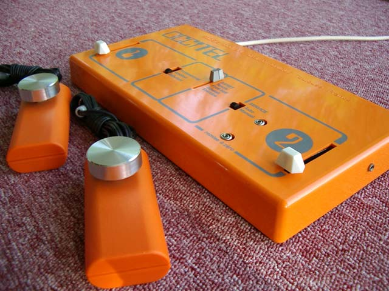
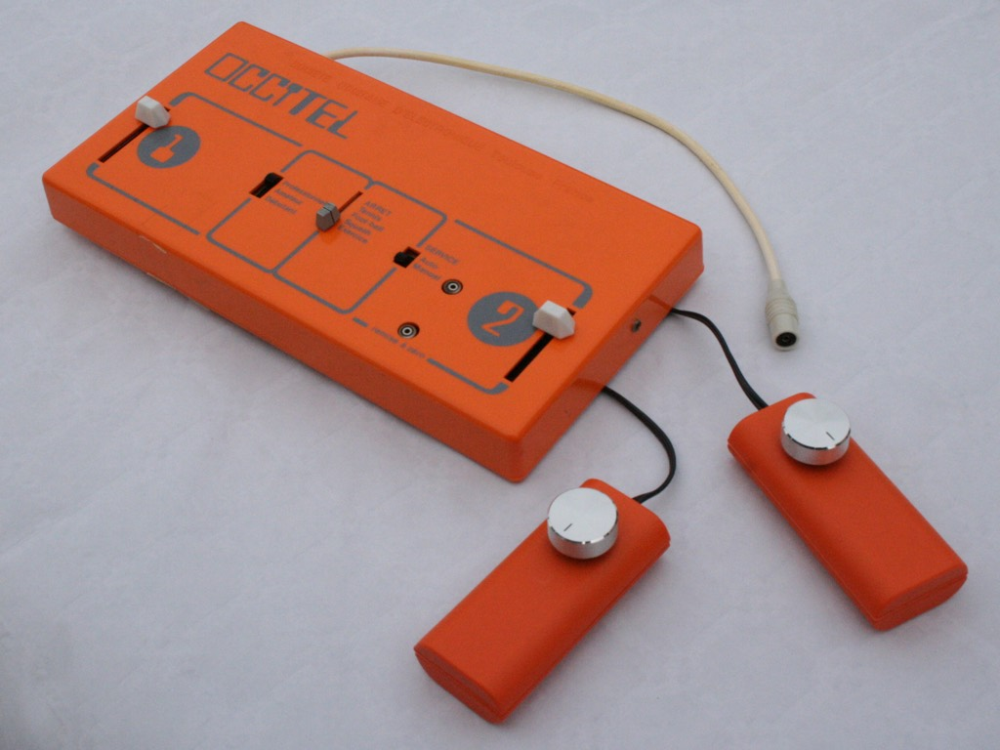

# [Occitel Mini](https://silicium.org/index.php/edition/occitel-mini-2), production (c)2020..2025 by [Silicium](http://silicium.org)

## TL;DR

[Occitel Mini](https://silicium.org/index.php/edition/occitel-mini-2) is a 1:2 scale reproduction of the original [Occitel](https://silicium.org/index.php/blog-catalogue/pongs/societe-occitane-d-electronique-occitel) game console released in 1976 by the [Société occitane d'électronique](https://fr.wikipedia.org/wiki/Société_occitane_d%27électronique), powered by the then brand-new [General Instruments](https://fr.wikipedia.org/wiki/General_Instrument) [AY-3-8500](https://fr.wikipedia.org/wiki/AY-3-8500) like every Pong-on-a-chip of the same era.

We manufactured a small batch #1, and who knows if there will ever be a batch #2…
Get one from us by [contacting Silicium](https://silicium.org/index.php/contactez-nous) or visit us [IRL at events](https://www.facebook.com/siliciumasso/photos/le-tgs-au-meett-de-toulouse-cétait-du-30-novembre-au-1er-décembre-si-vous-lavez-/1154207946707585/) such as the [Toulouse Game Show](https://tgs-toulouse.fr). \
It comes with a 70-page full color booklet filled with historical data, interviews, new and old photos, in a cardboard package that also is a 1:2 scale reproduction of the original, including cover art that only the connoisseur will know to appreciate…

### QuickStart
- plug into your TV A/V-in with a 75Ω composite lead
- plug in the supplied paddles
- connect a USB Micro-B cable to any power supply
  - caution: Occitel Mini draws _so little_ that a USB power bank may go to sleep
  - you can power and reprogram from any computer running the [Arduino IDE](https://www.arduino.cc/en/software)
- switch on the `game mode` selector
  - you will see 2 LEDs glowing through the case, blinking as the ball hits rackets—if they stop blinking, the software froze ⇒ please file a bug report
  - consult your 1976 Occitel manual regarding other controls
- by default, Occitel Mini emulates the 1976 revision of the AY-3-8500 chip—long-pressing `RàZ` alternates with the 1977 version
- the motherboard has a jumper for NTSC rather than PAL composite video: you may bridge the pads, or solder in a jumper or switch

### Legal
The family of the founder of Société Occitane d'Electronique gave association Silicium permission to reproduce and adapt their designs.

The Occitel book is copyrighted association Silicium in Toulouse, France, licensed under Creative Commons CC-BY-NC-SA.

Grant Searle did not explicit under what license he published his AVRPong a.k.a TVGame 1.5. He wrote "I hope this page has been useful" suggesting it is there for others to use (in other words, he must have meant the opposite of "all rights reserved"), "All information shown here is supplied "as is" with no warranty whatsoever" which is an element of typical licenses but does not grant any rights, "All copyrights recognised" which suggests he recognizes others copyright in prior works he derived his from.

However his Arduino source code is a single file that includes a copy of the Arduino TVout library and its license text, that happens to be the MIT license, therefore we interpret that the whole source code and by extension, the hardware schematics, are released under the MIT license.

The Occitel Mini schematics are a derivative work of Grant Searle's original work, with changes (c)Silicium, combination licensed under the MIT license.

The Occitel source code is a derivative work of TVout by Myles Metzer, with changes (c)Avamander, (c)Grant Searle, (c)members of Silicium (see list in [TL;DR](#tldr)), combination licensed under the MIT license.

The PCB and 3d-printed design are (c)members of Silicium, licensed under CC-BY-NC-SA.

## Changelog
Known bugs: none, unless there is still something wrong with the score in squash (single-player) game ??

Batch #1:
- PCB **1.5.0** (KiCAD 8.0)
- 3d-printed case **2024-11-19** (Fusion 360 -> STEP, STL)
- software **2025-01-11** for SparkFun Pro Micro ATmega32U4 (Arduino IDE 2.3)
- Git tag **1.0** public release and production batch #1

_Authors: Alain Trentin, ben*.* "foobarbaz", François "admin" Pussault, René "El Presidente" Speranza, Sébastien "Sebcbien" Périn, Simon "Nakwada" \
Supermodels: Jeff "Pocket" L., PStriolo_

Initial prototype on [Arduino Leonardo](https://store.arduino.cc/collections/boards-modules/products/arduino-leonardo-with-headers), then [SparkFun Pro Micro](https://www.SparkFun.com/pro-micro-5v-16mhz.html) on breadbord.
Initial schematics on [EasyEDA](https://easyeda.com/).

TODO: easter egg in sleep mode. OC6000 mini with AY-3-8610 emulation using X/Y joysticks on TRRS jacks.

## Design
### Principles of operation
#### The original

The 1976 Occitel is a standard application of the General Instrument AY-3-8500, outputting to a UHF modulator for French TV sets (SECAM 50Hz - there is not much difference with PAL as the Occitel is black&white).
It has an internal speaker and runs off 2 4.5V internal batteries or an external 9V transformer.

 \

Initially it had linear potentiometers in the main case, like the Téléscore 750 from SEB, but apparently it was decided to switch to external paddles, by bolding 3.5mm jack receptacles on the sides, wired in lieu of the integrated linear potentiometers, that were still installed but non-functional - it must have been quicker and less expensive to leave the linear potentiometer in place rather than making new injection molds.

#### The Mini
 \

Grant Searle having reverse-engineered the AY-3-8500 and implemented an emulator for ATmega328, all that was left to do was:
- convert to ATmega32U4 (there are differences in the hardware timers)
- set ball speed and paddle size according to the 3 difficulty settings of the Occitel
- fix a few bugs (the software runs for days, whereas the original crashed after an hour or so - we believe this was due to non-atomic variables shared between background and interrupt contexts).

There is no speaker in the Occitel Mini, instead you get an line-level mono audio output, compatible with any TV set A/V-in.

#### Paddles
 \

Occitel Mini has detachable paddles like the original.
Audio jacks as in the original Occitel are fine for 2-wire RC timing measurement as done by AY-3-8500, but are less than ideal for 3-wire potentiometric measurement as they are prone to shorting the contacts on insertion, which causes arcing between the ground and +5V rails and depending on your USB power supply, may brown out the CPU, causing the video to go out.

That problem is fixed by adding a current-limiting series resistor on the high side of the paddles' potentiometer.

#### Bit-banged composite video
Bit-banged composite video for Arduino was created by Avamander.
ATmega microcontrollers have no DMA and their SPI does not seem to be adequate as a shift register for gap-less pixel rendering, so assembly code toggles a GPIO one pixel at a time, using NOPs for horizontal timing.
Hardware timers are used for vertical timing, so there can be code in the background, and this is where the game logic runs, thus its timing is not critical.
Nonetheless, Pong is simple enough that Grant's code runs at full FPS.

Hardware-wise, we preferred to mix the luminance and sync GPIO outs with diodes (wired-or by diode-resistor logic) rather than pure resistors. This is a change made by JasonKits.

The mixing is passive, relying on the 75Ω termination in the composite video input of the TV set.

If you leave the video output unconnected, voltages will be wrong and an oscilloscope configured for video trigger may fail to recognize the composite sync. Just plug in a screen, or an external termination resistor.

#### ATmega328P vs. ATmega32U4
 \

On ATmega328P, Grant Searle used PB1(OC1A) for SYNC, PB2(OC1B) for VID and PB3(OC2A) for AUD.
Grant's original source code would run on an Arduino Uno wired as SYNC on pin D9, VID on pin D10, AUD on pin D11.

In fact VID and SYNC can be any pins as they are actually not used as OC1x. Also they do not have to be the MSB of a port data register, as imposed by recent versions of the TVout library.

ATmega32U4 does not have 8-bit timer 2 but has timer 0, so we reassigned AUD to timer 0.

Leonardo has a pin for OC0A (PB7 on pin D11) that can serve as AUD, but SparkFun Pro Micro does not.

OC0A is not available on SparkFun Pro Micro, but OC0B is on pin 0. So if OC0A and OC0B are loaded with the same value, timer 0 in CTC mode will do PWM based on OC0A and OC0B will output the toggled waveform same as OC0A (at worst, off by 1 timer increment).

So that is why AUD must be on SparkFun Pro Micro pin 3 (PD0 as OC0B).
VID is PB4 on pin 8 and SYNC is PB5 on pin 9.

On Leonardo, that would be VID on pin D8, SYNC on pin D9. And yes, the SparkFun Pro Micro numbering matches the Leonardo whenever possible.

While not necessary, the Pro Micro technique is compatible with Leonardo, if AUD is on pin D3 (that also is PD0).

### Making your own
- Send the [Gerber](./production_batch_1/occitel_mini-gerber+drill.zip) to JLCPCB or PCBWay etc.
- Solder in the [BoM](./production_batch_1/doc/occitel%20mini%20bom.csv) according to the [schematics](./production_batch_1/doc/occitel%20mini%20sch.pdf) and [layout](./production_batch_1/doc/occitel%20mini%20pcb.pdf)
  - Resistors are 1/8W through-hole or SMD (twin footprints).
  - Diodes are any fast small-signals Si diodes, 1N4007, 1N4148…
  - The audio DC-blocking capacitor can be any value in the μF range.
  - All 3 slide switches are the same SP5T, range-limited by the openings in the case. We found it on AliExpress, see the ["datasheet"](./kicad/1p5t_vertical.jpg). They have to be soldered such that the pins do not protrude from the bottom of the PCB, and the slider caps will be at just the right height. We 3d-printed a jig for holding the SP5T in place while soldering. YMMV…
  - the long-stem (13mm) and right-angle microswitches are common enough. You can use a different length and compensate for the length with the depth of the 3d-printed pushbutton caps.
- Obtain a SparkFun Pro Micro 5V/16MHz or clone and flash the [sketch](./Arduino/occitel_mini/occitel_mini.ino) (see [Contribute](#contribute) if you do not see SparkFun board options in the Arduino IDE).
> [!WARNING]
> The Arduino IDE has no way to know if you have a 8 or 16MHz Pro Micro, which this is critical to USB operation. Unfortunately 8MHz is the 1st menu entry.
> **Be sure to manually set cpu="ATmega32U4 (5V, 16 MHz)"**. Double-check board=="SparkFun Pro Micro" in case the IDE did not detect the USB PID/VID. See below for unbricking.
- Print the [enclosure](./production_batch_1/3d_print/) (the case is a 2-color print, [orange](./production_batch_1/3d_print/boitier.stl) and [white](./production_batch_1/3d_print/serigraphie.stl))
- Solder wires between the female 3.5mm jacks and motherboard (directly or using any connector with 0.1" spacing).
- Slice a 3.5mm audio jack patch cord (male-male) in half and solder each half to a 10kΩ potentiometer, to be installed in each paddle. For easy soldering, use stereo audio cable with individually jacketed left and right wires, not enamel-insulated bare copper strands.
- Assemble with M3x8 self-tapping screws.

### Modifying
- Circuit board: open [`kicad/occitel_mini`](./kicad/occitel_mini/) in [KiCAD](https://www.kicad.org) 8.x
  - beginners may prefer the [EasyEDA](https://easyeda.com/) [standard](https://easyeda.com/editor) or [pro](https://pro.easyeda.com/editor) online editors: import `historical/EasyEDA/SCH_occitel_mini.json` but be warned that the schematics is slightly outdated (no short-circuit protection at the paddle jacks) and was never routed in EasyEDA (routing done only in KiCAD)
  - alternatively, the circuit is easily constructed on a breadbord or perfboard
- Software: copy [`Arduino/occitel_mini/`](./Arduino/occitel_mini/) to your `Arduino/` folder
  - MacOS: `/Users/$USER/Documents/Arduino/`
  - Linux: `/home/$USER/Documents/Arduino/`
  - Windows: `C:\Users\%USERNAME%\Documents\Arduino\`
  - In order to see SparkFun options in the Arduino IDE board manager, you will need to add `https://raw.githubusercontent.com/sparkfun/Arduino_Boards/master/IDE_Board_Manager/package_sparkfun_index.json` to Settings. Or just use `Arduino Leonardo`.

#### Unbricking
If you brick your Pro Micro, [press the reset microswitch twice](https://cdn.SparkFun.com/datasheets/Dev/Arduino/Boards/32U4Note.pdf) within about 0.5s and you will have 8 seconds to press the `Download` button.

If all else fail, the motherboard has the standard Arduino ICSP header (unpopulated—solder a 3x2 HE10 header, or just unplug the Pro Micro module and use DuPont flying leads) that you can use to reflash the bootloader with an [STK500](https://www.microchip.com/en-us/development-tool/atstk500) (just kidding! get an AVR Dragon or the [Olimex AVR-ISP500-TINY](https://www.olimex.com/Products/AVR/Programmers/AVR-ISP500-TINY/)) programmer or the Arduino IDE menu [`Tools > Programmer > Arduino as ISP`](https://docs.arduino.cc/built-in-examples/arduino-isp/ArduinoISP/).

#### Source code
There are 2 compile-time settings:
- `DEBUG_CONSOLE` enables a rudimentary debugger on the serial console, that takes single-character commands `h`, `v`, `o`, `s`, `d`, `r`.
  - while useful if you do no have a DebugWire probe, the Arduino standard library for serial-over-USB appears unreliable in the presence of our direct timer programming, which is non-negociable for bit-banged video generation, so it is what it is.
- `SERIAL_USB_WAIT_DELAY_MS` is 1ms for fastest boot in the production build, but can be set e.g. to 1500ms so that the Arduino IDE serial monitor will have time to capture the early logs.

There are no other compile-time user settings, but you can change many things if you want to add games and depart from strict AY-3-8500 emulation.

You can also run `occitel_mini.ino` on other Arduino boards by selecting adequate assignments of timers and ATmega pins wired to your board's connectors.
See analysis in [ATmega328P vs. ATmega32U4](#atmega328p-vs-atmega32u4) and comments in the source code.

#### Extensibility
ADC pins A2 and A3 are unused (hence why we ran out of inputs for 1976/1977 AY-3-8500 selection) and could be used for 2 more potentiometer, for 4-player Pong, or Occitel OC6000 emulation and its mesmerizing AY-3-8610 soccer game where you can go not just up and down but also left and right… Revolutionary!

Democoders have output color video on ATmega, even on ATtiny.
There are 2 schools, RGB with resistor ladders as a crude DAC, and composite video.
Black&white composite video needs a single GPIO for luminance, and the color RGB resistor ladder technique can be used for greyscale.

PAL/NTSC Color composite is harder because a 4.43MHz color burst is needed for PAL (3.58MHz for NTSC), and then phase lock must be maintained.
This is not realistic on ATmega32U4 that is not fast enough to oversample the color burst by an integer ratio, and whose clock cannot be changed or else USB won't work.

But NTSC has been pulled off by democoders on ATmega328P overclocked to 28MHz by swapping the crystal, yielding a 8x oversampling of the colorburst, enough to obtain a few discrete digital phase shifts, exactly how Woz did it on the Apple II…

At that point, one might as well switch to an ESP32 or STM32 with DMA bit-banged video, or better, a Parallax Propeller or Raspberry Pi Pico (and its XMOS-inspired software-defined signal-shaping coprocessors), or a Raspberry Pi Zero as in the RGB2HDMI…

## Bibliography
### General Instruments AY-3-8500
- [www.pong-story.com](https://www.pong-story.com/gi.htm)
  _trad [fr](https://www-pong--story-com.translate.goog/gi.htm?_x_tr_sl=auto&_x_tr_tl=en&_x_tr_hl=fr&_x_tr_pto=wapp)_
- Occitel Mini would not exist without the amazing [work of Grant Searle](http://searle.x10host.com/AVRPong/index.html)
  _trad [fr](https://searle-x10host-com.translate.goog/AVRPong/index.html?_x_tr_sch=http&_x_tr_sl=auto&_x_tr_tl=en&_x_tr_hl=fr&_x_tr_pto=wapp)_
- Giancarlo Zuliani also did some reverse-engineering: [Analisi del gioco Pong](https://gzuliani.github.io/games/pong-emulator.html)
  _trad [fr](https://gzuliani-github-io.translate.goog/games/pong-emulator.html?_x_tr_sl=auto&_x_tr_tl=fr&_x_tr_hl=fr&_x_tr_pto=wapp)
       [en](https://gzuliani-github-io.translate.goog/games/pong-emulator.html?_x_tr_sl=auto&_x_tr_tl=en&_x_tr_hl=fr&_x_tr_pto=wapp)_
- Joris van Looveren implemented Grant Searle's design on a [custom PCB](http://joris.van-looveren.net/projects/avrpong/)
- JasonKits sells an [assembled board](https://www.tindie.com/products/jasonkits/classic-70s-pong-game/#product-description)
- Reverse engineering by [Cole Johnson](https://nerdstuffbycole.blogspot.com)
  - [Reverse Engineering the AY-3-8500, part 1: Demystifying the Pins](https://nerdstuffbycole.blogspot.com/2018/01/reverse-engineering-ay-3-8500-part-1.html)
  _trad [fr](https://nerdstuffbycole-blogspot-com.translate.goog/2018/01/reverse-engineering-ay-3-8500-part-1.html?_x_tr_sl=auto&_x_tr_tl=en&_x_tr_hl=fr&_x_tr_pto=wapp)_
  - [Building a Simulation of the AY-3-8500](https://nerdstuffbycole.blogspot.com/2018/04/building-simulation-of-ay-3-8500.html)
  _trad [fr](https://nerdstuffbycole-blogspot-com.translate.goog/2018/04/building-simulation-of-ay-3-8500.html?_x_tr_sl=auto&_x_tr_tl=fr&_x_tr_hl=fr&_x_tr_pto=wapp)_
  - [The Simulation is Finally Complete!*](https://nerdstuffbycole.blogspot.com/2018/08/the-simulation-is-finally-complete.html)
  _trad [fr](https://nerdstuffbycole-blogspot-com.translate.goog/2018/08/the-simulation-is-finally-complete.html?_x_tr_sl=auto&_x_tr_tl=fr&_x_tr_hl=fr&_x_tr_pto=wapp)_
  - [Control and Sync Generation in the AY-3-8500](https://nerdstuffbycole.blogspot.com/2018/08/control-and-sync-generation-in-ay-3-8500.html)
  _trad [fr](https://nerdstuffbycole-blogspot-com.translate.goog/2018/08/control-and-sync-generation-in-ay-3-8500.html?_x_tr_sl=auto&_x_tr_tl=fr&_x_tr_hl=fr&_x_tr_pto=wapp)_
  - [Entering the Retrochallenge! (09/2018)](https://nerdstuffbycole.blogspot.com/2018/09/entering-retrochallenge-092018.html)
  _trad [fr](https://nerdstuffbycole-blogspot-com.translate.goog/2018/09/entering-retrochallenge-092018.html?_x_tr_sl=auto&_x_tr_tl=fr&_x_tr_hl=fr&_x_tr_pto=wapp)_
  - [Games and Field Generation in the AY-3-8500](https://nerdstuffbycole.blogspot.com/2018/09/games-and-field-generation-in-ay-3-8500.html)
  _trad [fr](https://nerdstuffbycole-blogspot-com.translate.goog/2018/08/control-and-sync-generation-in-ay-3-8500.html?_x_tr_sl=auto&_x_tr_tl=fr&_x_tr_hl=fr&_x_tr_pto=wapp)_
  - [A visual simulation of the SP0256 (beta)](https://nerdstuffbycole.blogspot.com/2018/09/a-visual-simulation-of-sp0256-beta.html)
  _trad [fr](https://nerdstuffbycole-blogspot-com.translate.goog/2018/09/a-visual-simulation-of-sp0256-beta.html?_x_tr_sl=auto&_x_tr_tl=fr&_x_tr_hl=fr&_x_tr_pto=wapp)_
  - [Shifting bits: How a PONG chip generates on-screen scores](https://nerdstuffbycole.blogspot.com/2018/09/shifting-bits-how-pong-chip-generates.html)
  _trad [fr](https://nerdstuffbycole-blogspot-com.translate.goog/2018/09/shifting-bits-how-pong-chip-generates.html?_x_tr_sl=auto&_x_tr_tl=fr&_x_tr_hl=fr&_x_tr_pto=wapp)_
  - [RetroChallenge 2018 wrap up... and whats next](https://nerdstuffbycole.blogspot.com/2018/10/retrochallenge-2018-wrap-up-and-whats.html)
  _trad [fr](https://nerdstuffbycole-blogspot-com.translate.goog/2018/10/retrochallenge-2018-wrap-up-and-whats.html?_x_tr_sl=auto&_x_tr_tl=fr&_x_tr_hl=fr&_x_tr_pto=wapp)_
  - [Progress update on AY-3-8500 emulation](https://nerdstuffbycole.blogspot.com/2019/01/progress-update-on-ay-3-8500-emulation.html)
  _trad [fr](https://nerdstuffbycole-blogspot-com.translate.goog/2019/01/progress-update-on-ay-3-8500-emulation.html?_x_tr_sl=auto&_x_tr_tl=fr&_x_tr_hl=fr&_x_tr_pto=wapp)_
  - ["Febuary" Progress Update](https://nerdstuffbycole.blogspot.com/2019/03/febuary-progress-update.html)
  _trad [fr](https://nerdstuffbycole-blogspot-com.translate.goog/2019/03/febuary-progress-update.html?_x_tr_sl=auto&_x_tr_tl=fr&_x_tr_hl=fr&_x_tr_pto=wapp)_
  - [The AY-3-8606, another successfully simulated circuit](https://nerdstuffbycole.blogspot.com/2019/03/the-ay-3-8606-another-successfully.html)
  _trad [fr](https://nerdstuffbycole-blogspot-com.translate.goog/2019/03/the-ay-3-8606-another-successfully.html?_x_tr_sl=auto&_x_tr_tl=fr&_x_tr_hl=fr&_x_tr_pto=wapp)_
  - [Playable emulation, and more!](https://nerdstuffbycole.blogspot.com/2019/07/playable-emulation-and-more.html)
  _trad [fr](https://nerdstuffbycole-blogspot-com.translate.goog/2019/07/playable-emulation-and-more.html?_x_tr_sl=auto&_x_tr_tl=fr&_x_tr_hl=fr&_x_tr_pto=wapp)_
  - [Shooter game in silicon: inside the AY-3-8605 chip](https://nerdstuffbycole.blogspot.com/2019/10/shooter-game-in-silicon-inside-ay-3.html)
  _trad [fr](https://nerdstuffbycole-blogspot-com.translate.goog/2019/10/shooter-game-in-silicon-inside-ay-3.html?_x_tr_sl=auto&_x_tr_tl=fr&_x_tr_hl=fr&_x_tr_pto=wapp)_
  - [End of year update](https://nerdstuffbycole.blogspot.com/2020/01/end-of-year-update.html)
  _trad [fr](https://nerdstuffbycole-blogspot-com.translate.goog/2020/01/end-of-year-update.html?_x_tr_sl=auto&_x_tr_tl=fr&_x_tr_hl=fr&_x_tr_pto=wapp)_

### Bit-banged video composite generation on Arduino
- Avamander's finely crafted [Arduino-TVout](https://github.com/Avamander/arduino-tvout)
- If you want to do color RGB, have a look at the [Craft demo by Ift](https://www.linusakesson.net/scene/craft/) (release at [pouet.net](https://www.pouet.net/prod.php?which=50141))

### Datasheets
- General Instrument's AY-3-8500 "pong-on-a-chip"
  - [short datasheet](https://www.raphnet.net/divers/tvfun_repair/AY-3-8500.pdf) and [full datasheet](https://www.qsl.net/yt2fsg/games/AY-3-8500_12.pdf), also at [Internet Archive](https://archive.org/details/ay-3-8500-12/mode/2up)
  - [1978 catalog](https://www.pong-story.com/GIMINI1978.pdf)
- SparkFun [Pro Micro 5V/16MHz](https://www.SparkFun.com/pro-micro-5v-16mhz.html#documentation)
  - [how to unbrick](https://cdn.SparkFun.com/datasheets/Dev/Arduino/Boards/32U4Note.pdf)
  - [pinout](https://cdn.SparkFun.com/assets/f/d/8/0/d/ProMicro16MHzv2.pdf)
- [Pinout](https://docs.arduino.cc/resources/pinouts/A000057-full-pinout.pdf) of Arduino [Leonardo](https://docs.arduino.cc/hardware/leonardo/
), [pinout](https://content.arduino.cc/assets/Pinout-UNOrev3_latest.pdf) of Arduino [Uno](https://docs.arduino.cc/retired/boards/arduino-uno-rev3-with-long-pins/)
- Arduino Leonardo and SparkFun Pro Micro use the [ATmega32U4](https://www.microchip.com/en-us/product/atmega32u4)
  - [datasheet](https://ww1.microchip.com/downloads/en/DeviceDoc/Atmel-7766-8-bit-AVR-ATmega16U4-32U4_Datasheet.pdf) and [summary](https://ww1.microchip.com/downloads/en/DeviceDoc/Atmel-7766-8-bit-AVR-ATmega16U4-32U4_Summary.pdf)
  - [AVR8 Instruction Set Manual](https://ww1.microchip.com/downloads/aemDocuments/documents/MCU08/ProductDocuments/ReferenceManuals/AVR-InstructionSet-Manual-DS40002198.pdf)
  - Application Notes of interest:
    - [AN035 Efficient C Coding for AVR](https://ww1.microchip.com/downloads/aemDocuments/documents/OTH/ApplicationNotes/ApplicationNotes/doc1497.pdf)
    - [AN4027 Tips and Tricks to Optimize Your C Code for 8-bit AVR Microcontrollers](https://ww1.microchip.com/downloads/aemDocuments/documents/OTH/ApplicationNotes/ApplicationNotes/doc8453.pdf)
    - [AN1886 Mixing Assembly and C with AVRGCC](https://ww1.microchip.com/downloads/aemDocuments/documents/OTH/ApplicationNotes/ApplicationNotes/doc42055.pdf)
    - [AN072 Accessing 16-bit I/O Registers](https://ww1.microchip.com/downloads/aemDocuments/documents/OTH/ApplicationNotes/ApplicationNotes/doc1493.pdf)
    - [AN130 Setup and Use of AVR Timers](https://ww1.microchip.com/downloads/aemDocuments/documents/OTH/ApplicationNotes/ApplicationNotes/Atmel-2505-Setup-and-Use-of-AVR-Timers_ApplicationNote_AVR130.pdf)

../..
<!-- markdownlint-disable-file blank_lines -->
<!-- vim: set shiftwidth=2 softtabstop=2 expandtab : -->
